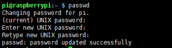

# 如何在Raspberry Pi 3B中安装RASPBIAN

## RASPBIAN简介

[RASPBIAN](https://www.raspberrypi.org/downloads/raspbian/)是树莓派官方支持的基于Debian的Linux系统。RASPBIAN预装了很多常用的组件，使用起来十分方便。

官方有**RASPBIAN STRETCH WITH DESKTOP**和**RASPBIAN STRETCH LITE**两个版本，**RASPBIAN STRETCH LITE**包含了必须的最小功能集，没有桌面环境，而**RASPBIAN STRETCH WITH DESKTOP**的功能更加齐全，并且提供了桌面环境，提供图形化的操作界面。

## Raspberry Pi 3B简介

Raspberry Pi 3B相关介绍参见[如何在Raspberry Pi 3B中安装Windows 10 IoT Core](../win10_iot_for_raspberry_pi_3b)

## 安装RASPBIAN

- 材料准备

1. Raspberry Pi 3B主板

1. Micro SD卡

1. 读卡器

1. 网线

1. 电源

1. 下载最新的[RASPBIAN](https://www.raspberrypi.org/downloads/raspbian/)系统。

1. 安装[Win32 Disk Imager](https://sourceforge.net/projects/win32diskimager/)

- RASPBIAN刻录

将Micro SD卡通过读卡器插入到PC中，格式SD卡

然后打开Win32 Disk Imager，选择我们下载的**RASPBIAN**镜像文件，和要写入的磁盘

等待写入完成

写入成功后可以看到以下两个磁盘

写入完成的同时可能会跳出格式化的警告，取消即可，不要进行格式化操作。因为里面包含了我们刻录好的系统，Windows系统当前无法识别改文件系统的格式。

- 启用SSH远程登录

默认系统禁用了SSH远程登录功能，我们可以在boot根目录下新建SSH空文件来启用SSH功能，可以直接执行以下命令

>new-item ssh -type file

- 运行Raspberry Pi 3B

准备工作做好后，我们将刻录好的Micro SD卡插入Raspberry Pi 3B中，并且插入网线和电源，通电后，Raspberry Pi 3B就开始运行了

- 查看Raspberry Pi 3B的IP地址

打开路由器的管理界面，查看新连接的设置，找到我们的Raspberry Pi 3B的IP

- SSH远程登录Raspberry Pi 3B

找到Raspberry Pi 3B的IP地址后，我们就可以使用默认账号**pi**和密码**raspberry**进行SSH远程登录了（可自行选择SSH远程登录工具，如XShell、putty等）

- 修改默认账号pi的密码

>passwd

- 设置root账号的密码

>sudo passwd root

- 启用root账号远程登录

默认情况下，root账号不允许直接远程登录，通过修改配置文件 **/etc/ssh/sshd_config** 可以启用root账号的远程登录权限

>su root
>nano /etc/ssh/sshd_config

在配置文件中添加如下行就可以启用root远程登录

>PermitRootLogin yes

- 连接WIFI

Raspberry Pi 3B本身自带了WIFI模块，我们可以直接使用WIFI来解放网线

查看当前接收到的无线网信号

>iwlist wlan0  scan

通过wpa_passphrase命令获取连接指定wifi需要的配置
>wpa_passphrase   ssid  passwd

打开配置文件
>nano /etc/wpa_supplicant/wpa_supplicant.conf

将wpa_passphrase命令打印出的结果，添加到文件的末尾,如下所示

打开配置文件，为wlan0手动设置IP地址等信息
>nano  /etc/dhcpcd.conf

配置示例如下：

>#设置wlan0
>
>interface wlan0
>
>#设置IP地址
>
>inform 192.168.0.111
>
>#设置网关
>
>static routers=192.168.0.1
>
>#设置DNS
>
>static domain_name_servers=192.168.0.1
>
>static domain_search=192.168.0.1

设置完毕后，拔掉网线，重启树莓派，开机后使用手动设置的IP地址和新的密码重新连接即可

- 开机时启动指定的程序

设置开机启动的方式有很多，这里只举例一种较为简单的

打开 **/etc/rc.local** 配置文件，在exit 0之前添加你需要执行的命令，开机启动时就会自动执行

>sudo nano /etc/rc.local

例如下面所示，开机时运行我们自定义的脚本来启动ngrok代理服务

>exec  /home/pi/ngrok/bin/start_ngrok_ssh.sh

