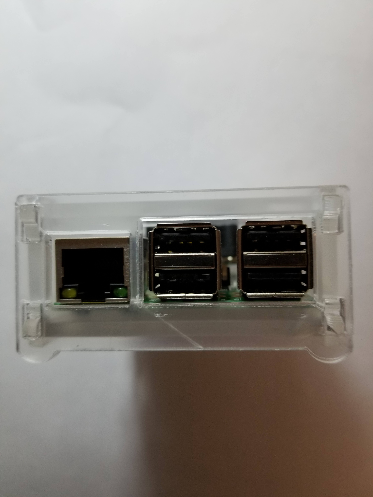
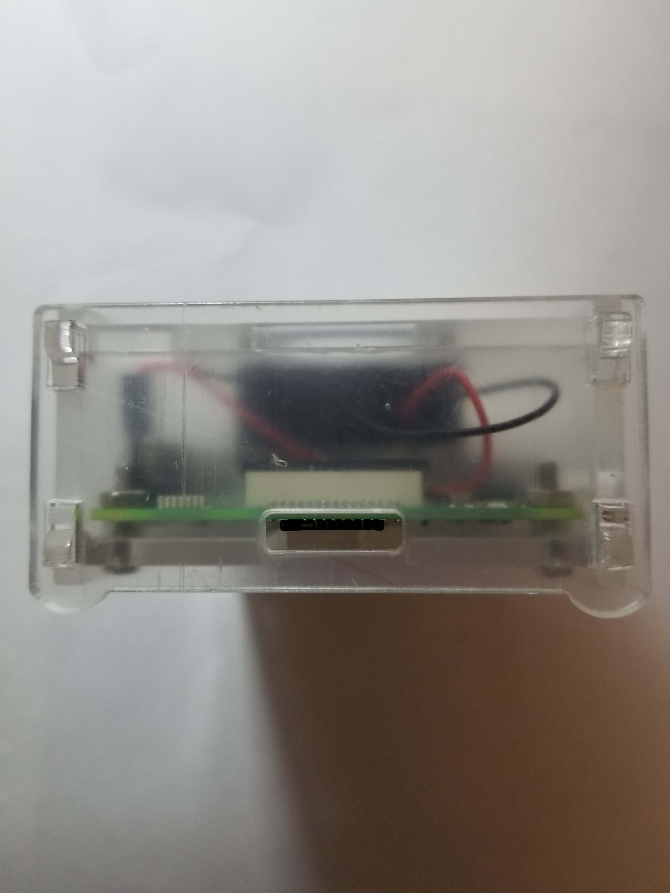
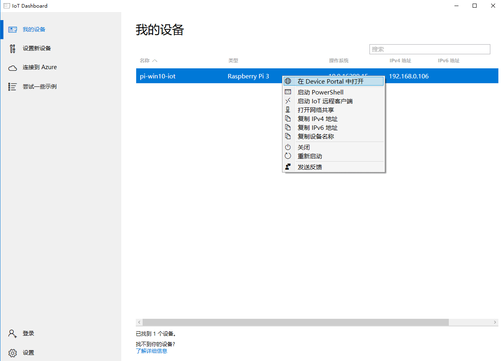
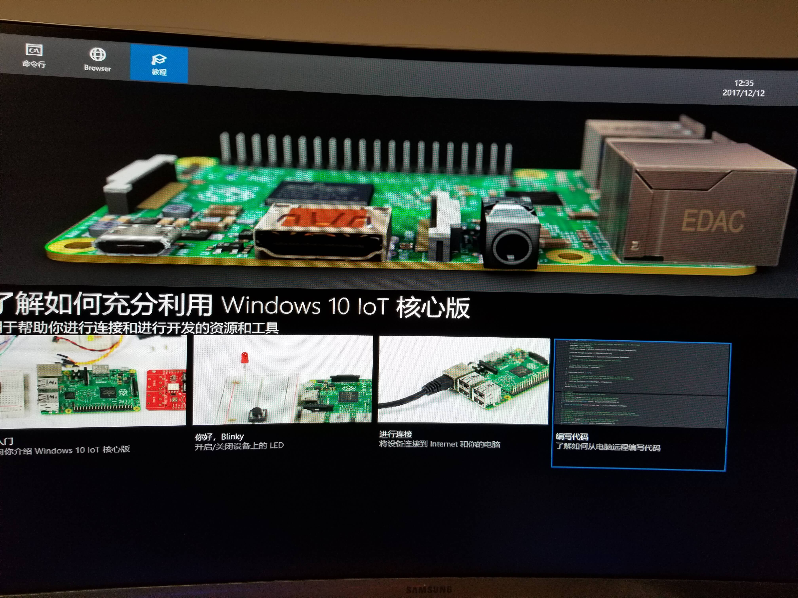

# 如何在Raspberry Pi 3B中安装Windows 10 IoT Core

## Windows 10 IoT Core简介

[Windows 10 IoT](https://developer.microsoft.com/en-us/windows/iot)是微软专门为物联网生态打造的操作系统，Windows 10 IoT Core则是Windows 10 IoT 操作系统的核心版本，功能相对精简。使用Windows 10 IoT可以打造属于自己的物联网生态系统。

### Windows 10 IoT的版本介绍

- Windows 10 IoT 企业版

>Windows 10 IoT 企业版将 Windows 10 企业版功能广泛应用于零售、制造、医疗、金融和其他行业的设备上。Windows 10 IoT 企业版设备运行功能强大的业务线应用并以安全、可靠且简化的方式执行专用功能，以支持关键任务型行业设备。
>
>Windows 10 IoT 企业版同时支持通用 Windows 应用和经典 Windows 应用，还提供很多创新性功能：针对现代安全威胁的高级保护，充分的部署灵活性、更新选项和支持选项，以及全面的基础结构、设备和应用管理功能。对于需要可管理性、一致性和可预测性的公司，请选择 Windows 10 IoT 企业版和 Windows 10 企业版。

- Windows 10 IoT 移动企业版

>Windows 10 IoT 移动企业版为需要自然的用户体验以及企业级安全和可管理性的业务线移动设备提供 Windows 10 移动企业版的功能。它即时的应用访问、对条码扫描和其他外设的固有支持以及安全的设备体验可以在各种移动情形下提升工作效率。
>
>移动企业版还提供很多其他功能，如多个用户配置文件和高级锁定，以支持零售、医疗保健、制造和其他垂直行业中的移动业务线情形。

- Windows 10 IoT 核心版

>Windows 10 IoT 核心版是针对较小的低成本行业设备进行了优化的 Windows 10 版本。这个版本专为支持 IoT 网关或微型自助服务终端等设备而构建，旨在运行单个业务线应用。Windows 10 IoT 核心版运行通用 Windows 应用并使用与其他 Windows 10 版本相同的开发、配置和管理工具，这使它可以轻松集成到 IoT 方案并利用现有资源。

## Raspberry Pi 3B简介

Raspberry Pi 3B即第三代树莓派，主要配置为

- 1G内存
- 4核CPU 1.2GHz ARM Cortex-A53 64位 (ARMv8系列)
- USB接口 *4
- HDMI接口
- RJ45网络接口
- 3.5mm音频插孔
- MicroSD卡插槽
- 支持蓝牙
- 支持WIFI

目前Raspberry Pi支持多种操作系统,常见的系统有以下几种,主要基于Linux与Windows平台：

- NOOBS
- RASPBIAN
- UBUNTU MATE
- SNAPPY UBUNTU CORE
- WINDOWS 10 IOT CORE
- OSMC
- LIBREELEC
- PINET
- RISC OS
- WEATHER STATION
- ICHIGO JAM RPI

其中使用最频繁的操作系统应该属RASPBIAN莫属了，一个基于Debian的Linux操作系统,主流支持的操作系统，详情参见[Raspberry Pi系统下载](https://www.raspberrypi.org/downloads/)。

## 材料准备

- Raspberry Pi 3B

- USB数据线

- MicroSD储存卡

- 电源
- 网线
- MicroSD读卡器

## Raspberry Pi 3B展示

### Raspberry Pi 3B正面

### Raspberry Pi 3B背面

### Raspberry Pi 3B USB接口面

### Raspberry Pi 3B HDMI&Power&Audio面

### Raspberry Pi 3B SD卡面

## 安装Windows 10 IoT Core

要在Raspberry Pi 3B中安装Windows 10 IoT Core,首先需要下载安装官方的[Windows 10 IoT Core Dashboard](https://developer.microsoft.com/en-us/windows/iot/Downloads)软件。

下载成功后，双击运行就会开始进行在线下载安装。

在下载安装的过程中，我们可以将存储卡通过读卡器插到PC上，对其进行格式化，清空其中的数据。

等安装完成后，我们打开Dashboard,在设置新设备中选择我们要运行的平台以及要安装的操作系统，如下图所示

在驱动器选项上找到我们刚才插入的存储卡，设定好设备名称和系统密码（保存好密码，后面登录IoT要使用），就可以点击下载安装，将Windows 10 IoT Core系统写入我们的存储卡中了。

系统写入完成后，SD会被进行分区，并弹出格式化的提示，点击取消即可，不要进行格式化操作。

一切准备就绪，拔出SD卡，将SD卡插入Raspberry Pi 3B中，接通电源，我们的树莓派就开始运行啦！首次运行的时候记得插上网线,因为我们需要通过远程连接来操作树莓派。
当树莓派的灯点亮后，稍等一会，然后刷新我Windows 10 IoT Core Dashboard中的**我的设备**列表，就可以看到我们的IoT系统已经运行成功并且被识别到了。

右击我们的设备，可以看到有三种方式可以连接到我们的树莓派

- 在Device Portal中打开

在Device Portal中打开是通过Web方式来访问树莓派中的IoT系统，在Device Portal我们可以查看系统的状态、进程的信息、管理应用等等。

打开网站，会提示我们输入用户名密码，默认的用户名为超级管理员账号Administrator，密码为我们写入系统时设置的密码。

登录成功后，我们可以看到各种系统数据，以及操作菜单，例如可以在Processes下的Performance菜单中看到当前CPU，内存，IO的使用情况。

当前，我们是使用网线来登录到IoT上，这样未免有点麻烦，而且Raspberry Pi 3B本身支持WIFI模块，使用WIFI显然是更好的选择。

在Connectivity->Network菜单下的表格中我们可以看到当前可以扫描到的所有WIFI信号，选择我们自己的WIFI，并且输入密码就可以连接上WIFI,
下次启动的时候就不在需要插入网线了，WIFI信号会自动连接。

现在拔掉网线，重启IoT，可以看到WIFI连接成功，IoT Dashboard中成功识别到设备。

- 启动PowerShell

还有一种常用的方式就是通过在PowerShell下通过命令行的方式来操作我们的树莓派设备，这样的灵活性会更高。

跟Device Portal一样，登录PowerShell的时候，同样需要输入用户名密码，跟上面的保持一致即可，登录成功后，我们就可以在命令行下操作IoT系统了。

- 启动IoT远程客户端

IoT远程客户端是类似远程桌面的方式，以图像化的界面来连接我们的IoT系统，这需要下载对应的Windows APP来进行连接。直接点击启动IoT远程客户端，会提示我们安装Windows IoT Remote Client，下载安装即可。

安装完成后，再次点击启动IoT远程客户端，选择我们的设备进行连接，会发现依旧连接超时或失败，这是因为Windows IoT Remote Client需要有对应的服务器端支持，我们需要进入Device Portal进行启用。

打开Device Portal网站，进入Remote菜单，里面会提示我们下载对应的客户端，这里我们已经下载好了，可以直接忽略。
直接勾选Enable Windows IoT Remote Server就可以启用远程连接服务。

但是，在实际操作中，可能并没有理论上那么顺利，启用远程服务器可能会操作失败，重启之后也依旧是如此，错误如下所示。

先检查我们的当前操作系统的版本，然后去Google搜寻一下解决方案。可以看到我们当前系统的版本为**10.0.16299.15**

通过搜索错误信息，可以看到其他人也遇到了类似的[问题](https://docs.microsoft.com/en-us/windows/iot-core/manage-your-device/remotedisplay)

以下是官方给出的[解决方案](https://docs.microsoft.com/en-us/windows/iot-core/release-notes/commercial/fallcreatorsupdate)

>The Windows IoT Remote client does not work for Raspberry Pi. 
Use a board with accelerated graphics such as Minnowboard Max or Dragonboard or attach a monitor for local display.

可以看到当前树莓派不支持Windows IoT Remote Server，那么我们可以尝试更新一下系统，看看这个问题是否已经被解决。

在Windows Update菜单下，直接选择Check for updates，等待更新检查与下载，更新完毕后会提示重启，直接重启即可。

重启后，我们刷新Windows 10 IoT Core Dashboard，等待IoT重新上线。但是问题又来了，半小时过去了，系统一直没有被Dashboard识别到，很有可能没有启动成功，这个时候就比较尴尬了，我们没法判断系统当前的状态。

无奈之下只能使用HDMI接口连接显示屏进行本地连接查看了。动手拔下我们PC的视频HDMI线，插入到树莓派的HDMI接口上，屏幕瞬间点亮，即插即用，这一点还是非常方便的。

此时我们可以看到屏幕上只有进度条，说明系统还没更新完毕，我们只能等待系统更新完成了。

在等待了N久之后，发现这个更新又是一个坑，Windows 10 IoT Core更新超乎寻常的慢，不知道等待了多久，可能至少有一个多小时吧，系统才好不容易更新完毕。

更新完后，进入系统的主界面，然后默默的插入鼠标键盘开始查看起来。

进入Windows开机界面，并没有看到想象中的开始菜单，资源管理器等等，只有简单的一个界面，显示了一些树莓派的参数，以及一些简单的Demo，别无其他UI程序。

现在我们将显示屏插回主机，可以看到Windows 10 IoT Core Dashboard已经重新识别到我们的树莓派了，再次进入Device Portal，可以看到当前的最新版本为**10.0.16299.125**。尝试开启远程服务，发现依旧还是报错，看来Windows IoT Remote Server还是不可用。不过目前Windows IoT Remote Server暂时对我们来说用处也不是很大，姑且不用管他。

最后附上正常运转的树莓派实物图

